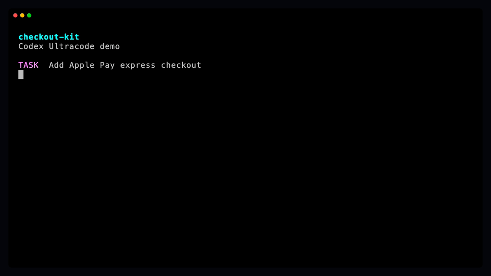

# Ultracode Skill

[](LICENSE)
[](https://developers.openai.com/api/docs/guides/tools-skills)
[](https://code.claude.com/docs/en/skills)
[](https://antigravity.google/docs/skills)
[](https://github.com/PabloNAX/ultracode-skill/stargazers)

Ultracode Skill gives Codex a dynamic workflow layer for serious coding tasks: planning, native agents, integration, and final verification without turning the repo into a separate runner.



Use it when a task needs more than one pass: discovery, implementation, review, tests, and a final integration step. The skill tells the agent how to decide between a direct edit, a packetized workflow, or native agent delegation.

Codex is the main target. Claude Code already has first-class workflow concepts; Codex has native multi-agent tools, but users still need a clean operating pattern around them. Ultracode fills that gap with one small `SKILL.md` folder.

## What it does

Ultracode asks the agent to:

1. Define the goal and success criteria.
2. Decide whether the task needs direct, workflow, or delegated mode.
3. Create workflow artifacts for non-trivial work.
4. Use native agents when they are useful and allowed by the host.
5. Keep integration in the parent session.
6. Use lightweight eval contracts for risky shared surfaces.
7. Verify the result before answering, with a final audit for high-risk runs.

For Codex, that means the skill can use native `spawn_agent` for independent packets, then integrate the results in the parent session.

## Install

The installable skill folder is `ultracode/`.

### Codex

```bash
mkdir -p "${CODEX_HOME:-$HOME/.codex}/skills"
cp -R ultracode "${CODEX_HOME:-$HOME/.codex}/skills/"
```

Restart Codex after installing.

### Claude Code

```bash
mkdir -p "$HOME/.claude/skills"
cp -R ultracode "$HOME/.claude/skills/"
```

### Antigravity

Workspace install:

```bash
mkdir -p .agents/skills
cp -R /path/to/ultracode .agents/skills/
```

User install:

```bash
mkdir -p "$HOME/.gemini/antigravity/skills"
cp -R ultracode "$HOME/.gemini/antigravity/skills/"
```

## Usage

Start with the short form:

```text
Use $ultracode to build this feature end to end.
```

You do not have to manually design the workflow or ask for subagents. Ultracode decides whether the task needs a direct edit, a workflow, or native agents.

For non-trivial Codex tasks, `$ultracode` is delegated-workflow intent: when useful native agents are available, Ultracode should prefer a small bounded fan-out instead of doing every independent packet in one session.

If you want to force a delegated run, you can still say it directly:

```text
Use $ultracode. Split this across agents where it is safe, keep integration in the parent session, and verify the final patch.
```

## Modes

| Mode | Use it for | Behavior |
| --- | --- | --- |
| Direct | Small, clear edits | No workflow files unless needed. Run the narrowest useful check. |
| Workflow | Multi-step work without useful delegation | Write plan, packet, result, integration, and final report files. |
| Delegated | Independent packets where native agents are available | Spawn bounded agents, keep the critical path local, integrate results, verify. |

## Workflow files

For non-trivial tasks, Ultracode writes plain Markdown and JSON:

```text
.workflow/ultracode/<run-slug>/
  plan.md
  orchestration.md
  state.json
  packets/
  results/
  integration.md
  final-report.md
```

High-risk or cross-surface runs may also include `eval-contract.md`, `contracts/`, `handoffs/`, or `final-audit.md`.

These files make the run inspectable. You can see what was delegated, what changed, what passed, and what risk remains.

## Codex behavior

When Codex exposes native agent tools, Ultracode prefers real delegation over fake packet simulation.

The parent session should:

- keep the critical path local
- spawn `explorer` agents for read-only discovery
- spawn `worker` agents only with clear file ownership
- prefer 2-4 sidecar agents for useful independent packets
- stay under 5 total sidecar agents unless the user approves more
- avoid combining `agent_type` with a full-history fork
- wait only when a result blocks the next parent step
- close agents after collecting their results

If native agents are unavailable, blocked by policy, or not useful for the task, Ultracode falls back to workflow mode and records the concrete reason.

## Live test

This skill was tested in Codex with a fresh demo repository.

Result:

- `$ultracode` loaded the skill
- `.workflow/ultracode/...` artifacts were created
- Codex used native `spawn_agent`
- tests passed
- the parent session integrated the agent results

## What it is not

Ultracode Skill does not ship a background service, hidden runner, or required scripts. It is a small skill folder that teaches the agent how to run high-effort coding workflows with the tools already available in the current host.

## Repository name

The repo is `ultracode-skill`.

The skill name is `ultracode`, so users can invoke it with:

```text
$ultracode
```

## Star history

[](https://star-history.com/#PabloNAX/ultracode-skill&Date)

## License

MIT.
